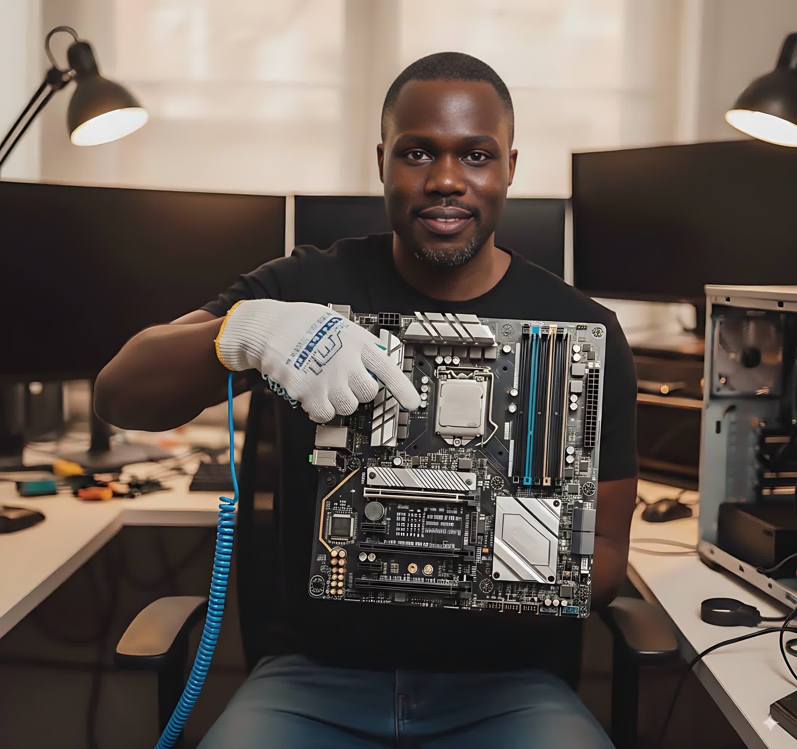

# Lab 01 – PC Components & Safety

Objective:
Identify the main internal and external components of a personal computer, understand their functions, and apply proper safety procedures when handling hardware.

Safety Gear: 

To ensure proper handling of computer hardware and prevent damage from electrostatic discharge (ESD), the following safety equipment was used during this lab:

-Anti‑Static Wrist Strap – Worn on the wrist and clipped to a grounded metal part of the PC case to safely dissipate static electricity before touching internal components. This prevents accidental ESD that could damage sensitive parts such as the CPU, RAM, and motherboard.

-ESD‑Safe Gloves – Lightweight, conductive‑fiber gloves worn when handling delicate components to avoid transferring skin oils or fingerprints to contacts and circuitry. These gloves also provide an additional layer of static protection while maintaining dexterity.

Rationale:  
Using both an anti‑static wrist strap and ESD‑safe gloves demonstrates adherence to industry‑standard safety protocols. This not only protects the hardware but also reflects professional practice expected in IT support and repair environments.

 Reference Material:
1. Technical Education and Skills Development Authority (TESDA). Introduction to Computer Hardware Servicing (NC II). Philippines: TESDA, 2013.  
    – Official government training module covering PC hardware, safety, preventive maintenance, and basic troubleshooting.

2. Cisco Networking Academy. IT Essentials, Version 8. Cisco Systems, Inc.  
    – Comprehensive IT support curriculum aligned with CompTIA A+ objectives, including hardware, operating systems, networking, and security labs.

3. IBM SkillsBuild. IT Support Fundamentals Learning Path. IBM Corporation. Available at: [IBM SkillsBuild IT Support Courses](https://skillsbuild.org/students/course-catalog/it-support)  
    – Free, self‑paced modules covering hardware, software, networking, troubleshooting, cloud, and customer service skills. Used for supplementary diagrams, terminology, and scenario‑based exercises.

Tools & Resources
- Anti-static wrist strap
- Phillips screwdriver
- Manufacturer’s PC manual (if available)
- Camera or smartphone (for documentation)
- Compressed air (optional, for cleaning)

Components Identified

| Internal Component |             Components Function                 |    Photo       
|--------------------|-------------------------------------------------|----------------|
| Motherboard        | Main circuit board that connects all components |  |
| CPU                | Executes instructions and processes data        |  |
| RAM                | Temporary storage for active processes          |  |
| Storage Drive (HDD/SSD) | Permanent data storage                     |  |
| Power Supply Unit (PSU) | Converts AC to DC power for components     |  |
| GPU                | Handles graphics rendering                      |  GPU Photo  |

 
|External Component | Components Function  |  Photo    |
|-------------------|----------------------|-----------|
| Monitor  | Displays visual output        |  Monitor Photo    |
| Keyboard | Input device for text and commands | Keyboard Photo |
| Mouse    | Pointing device for navigation     | Mouse Photo |
| Speakers/Headset | Audio output | Speakers/Headset Photo |

Safety Procedures Followed
1. Power Down & Unplug the PC before opening the case.
2. Wear an Anti‑Static Wrist Strap to prevent electrostatic discharge (ESD).
3. Work on a Non‑Conductive Surface (e.g., wooden table).
4. Handle Components by the Edges — avoid touching circuitry.
5. Keep Drinks and Food Away from the workspace.
6. Organize Screws and Small Parts in a container.

Steps Taken
1. Cleared workspace and gathered tools.
2. Powered down and unplugged the PC.
3. Wore anti‑static wrist strap and connected it to a grounded surface.
4. Opened the PC case using a Phillips screwdriver.
5. Identified and photographed each internal component.
6. Closed the case and reconnected peripherals.

 Outcome
- Successfully identified all major PC components.
- Practiced safe handling procedures to prevent damage.
- Created a photo catalog of components for future reference.

