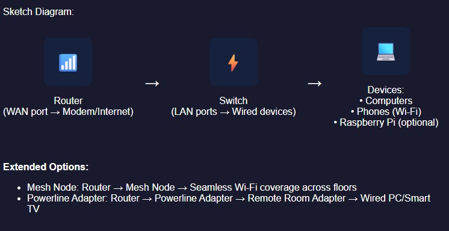

**Author:** Victor Onokopasah
**Lab:** 03 – SOHO-Network-Setup-Troubleshooting
**Date:** March 2025

## Lab 03: - SOHO-Network-Setup-Troubleshooting
Objective
Build a functional Small Office/Home Office (SOHO) network, configure IP settings, troubleshoot common connectivity issues, and demonstrate CLI-based diagnostics using industry-standard tools.

This exercise builds key networking administration skills in:

- Network topology design and device configuration
- IP address management (static/dynamic)
- DHCP/DNS configuration and troubleshooting
- Wi-Fi optimization and LAN connectivity validation
- Cross-platform CLI troubleshooting
  
## Key Skills
- Network topology planning (router/switch placement)
- IP configuration (static vs. dynamic addressing)
- DHCP scope setup and DNS resolution troubleshooting
- Wi-Fi performance optimization (channel selection)
- CLI-based network diagnostics (ping, tracert, ipconfig/ifconfig)
  
## Tools Used
- Hardware: Router (e.g., TP-Link Archer AX50), Ethernet switch (e.g., Netgear GS308), 2–3 computers/laptops, smartphones/tablets, optional Raspberry Pi
- Software/Utilities: Wi-Fi analyzer (NetSpot), terminal (CMD/Bash), port forwarding tester (CanYouSeeMe.org)
- Commands: ping, tracert, ipconfig (Windows), ifconfig, nslookup (Linux/macOS)
- Diagramming: draw.io (for topology diagram), Mermaid (for diagram‑as‑code in GitHub)

## Step 1: Network Topology Design  

> Extended Options:  
> - Mesh Node: Router → Mesh Node → Seamless Wi-Fi coverage across floors  
> - Powerline Adapter: Router → Powerline Adapter → Remote Room Adapter → Wired PC/Smart TV

