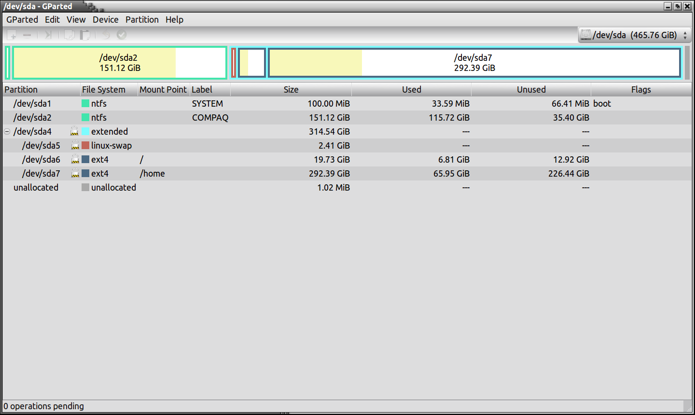
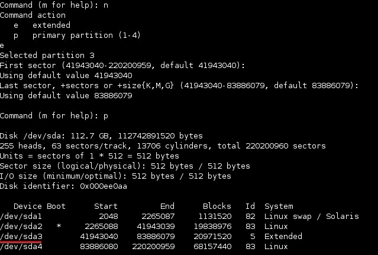

Lab 02: Partition Setup Log — Dual-Boot Windows 11 + Ubuntu 22.04

Lab Name: lab-02-windows-linux-installation
Author: Victor Onokopasah
Date: 2024-09-23

Objective
Perform a dual-boot setup with Windows 11 and Ubuntu 22.04, configure disk partitions for both operating systems, simulate GRUB bootloader failure, perform recovery, and document the full process with logs and screenshots.

This exercise builds key system administration skills in:

. Disk partitioning & file system management
. Dual-boot configuration with Windows + Linux
. GRUB bootloader troubleshooting & recovery
. User and privilege management
. Technical documentation for system recovery

## Key Skills
- Disk partitioning and OS installation
- GRUB bootloader troubleshooting
- User account configuration with least privilege
- Cross-platform recovery documentation

## Tools Used
. Windows Disk Management (installer)
. Ubuntu 22.04 Installer (GParted, fdisk)
. grub-install, update-grub (for GRUB recovery)
. Terminal (CMD, Bash)
. Screenshot tools (Windows Snipping Tool, Ubuntu Screenshot utility)

Step 1: Windows Partitioning
Tool Used: Windows Disk Management

1. Booted into Windows 11 installer via USB.
2. Selected "Custom Installation" option.
3. Created the following partitions:
- EFI System Partition → 100 MB, FAT32
- Microsoft Reserved Partition → 16 MB
. Primary Partition for Windows → 100 GB, NTFS
. Unallocated Space → ~100 GB (left free for Ubuntu)

 Screenshot:

Step 2: Ubuntu Partitioning
Tools Used: GParted + fdisk (via Ubuntu Installer)

1. Booted into Ubuntu 22.04 installer via USB.
2. Opened GParted and created the following partitions:
. Root Partition / → 50 GB (ext4)
. Swap Partition → 4 GB (swap)
. Home Partition /home → 46 GB (ext4)

 Screenshot:

Verified partitions using fdisk:

sudo fdisk -l

 Screenshot:

Sample Output:
/dev/sda1  EFI System Partition
/dev/sda2  Microsoft Reserved
/dev/sda3  Windows Primary (NTFS)
/dev/sda4  Linux Root (/)
/dev/sda5  Linux Swap
/dev/sda6  Linux Home (/home)

Step 3: GRUB Installation & Recovery
1. During Ubuntu installation, GRUB installed automatically to the EFI partition.
2. To simulate failure, GRUB bootloader was corrupted. System initially booted directly into Windows.
3. Booted into Ubuntu Live USB and ran recovery commands:

sudo mount /dev/sda4 /mnt        # Mount root partition
sudo mount /dev/sda1 /mnt/boot/efi   # Mount EFI
sudo mount --bind /dev /mnt/dev
sudo mount --bind /proc /mnt/proc
sudo mount --bind /sys /mnt/sys
sudo chroot /mnt
grub-install /dev/sda
update-grub
exit
sudo reboot

4. After reboot, GRUB menu restored with options for both Windows 11 and Ubuntu 22.04.

## Notes
. Partitioning strategy ensures system isolation & data integrity.
. EFI partition is shared between Windows and GRUB.
. Swap partition improves performance in low-RAM scenarios.
. ext4 file system chosen for Linux partitions due to journaling and wide compatibility.

## References
. Cisco IT Essentials v8 – OS & Bootloader Modules
. IBM SkillsBuild – OS Fundamentals
. TESDA NC II – Hardware Servicing & Safety

## Outcome
. Dual-boot system successfully installed with Windows 11 and Ubuntu 22.04
. GRUB bootloader failure simulated and restored using grub-install
. Verified dual-boot functionality with partition screenshots and fdisk logs
. Documentation complete with tools, partitioning steps, commands, outcomes, and references

